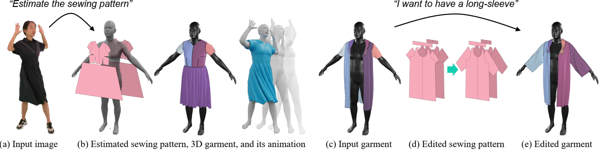
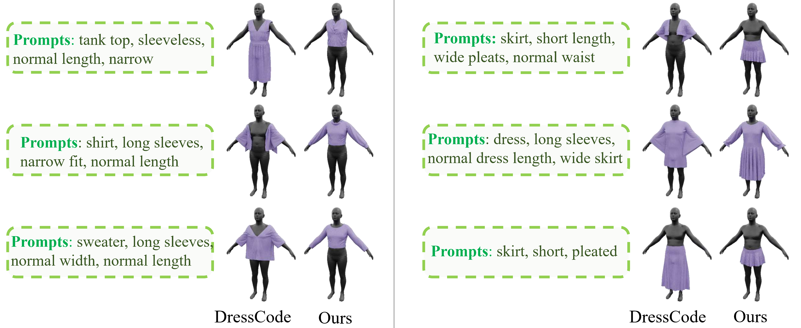

<!-- PROJECT LOGO -->

<p align="center">
  <h1 align="center">ChatGarment: Garment Estimation, Generation and Editing via Large Language Models
 </h1>
  <div align="center">
    
  </div>
</p> 


This is the implementation of ChatGarment. More details please check our 
[[Project Page](https://chatgarment.github.io/)].

ChatGarmen utilizes large vision-language models (VLMs) to automate the estimation, generation, and editing of 3D garments from images or text descriptions. 


## Applications

|   |  |
| :--------------------: | :----------: |
| Image-based Reconstruction | Text-based Generation |
|   |     |
| Text-based Editing | Text-based Editing |


## Relevant Repositories
1. [**GarmentCodeRC**](https://github.com/biansy000/GarmentCodeRC): A refined version of the original [GarmentCode](https://github.com/maria-korosteleva/GarmentCode), used by ChatGarment for garment generation.

2. [**ContourCraft-CG**](https://github.com/biansy000/ContourCraft-CG): A refined version of the original [ContourCraft](https://github.com/Dolorousrtur/ContourCraft), used by ChatGarment for garment simulation.

3. [**ChatGarmentDataset**](https://huggingface.co/datasets/sy000/ChatGarmentDataset): A Hugging Face dataset with training and inference data used in our paper.


## Installation
The installation instructions are provided in ``docs/Installation.md``.

## Model Training
The training data is available in [ChatGarmentDataset](https://huggingface.co/datasets/sy000/ChatGarmentDataset).
```Shell
./scripts/v1_5/finetune_task_lora_garmentcode_wholebody_combineT2.sh
```

## Model Inference

#### 1. Image-based Reconstruction (CoT)
```Shell
# Run image based reconstruction with CoT for images in example_data/example_imgs/
# Detailed steps of the script:
# 1. Accepts an input image.
# 2. Utilizes ChatGarment Model to generate text prompts based on the image.
# 3. Sends the ChatGarment-generated text & input image to ChatGarment Model again.
# 4. Outputs the final GarmentCode sewing patterns.
./scripts/v1_5/evaluate_garment_v2_imggen_2step.sh example_data/example_imgs/
```


#### 2. Text-based Generation
```Shell
# Run text based generation for prompts given in the input JSON file
# Detailed steps of the script:
# 1. Accepts an input json file.
# 2. Utilizes GPT-4o to generate well-formed text descriptions based on the original prompts.
# 3. Sends the GPT-generated text to ChatGarment Model.
# 4. Outputs the final GarmentCode sewing patterns.
./scripts/v1_5/evaluate_garment_v2_textgen.sh example_data/example_jsons/example_textgen_prompts.json
```


#### 3. Garment Editing
```Shell
# Run text based generation for prompts given in the input JSON file
# Detailed steps of the script:
# 1. Accepts an input json file.
# 2. Utilizes GPT-4o to generate well-formed editing prompts based on the original prompts.
# 3. Sends the GPT-generated text to ChatGarment Model.
# 4. Outputs the final GarmentCode sewing patterns.
./scripts/v1_5/evaluate_garment_v2_demo_edit.sh example_data/example_jsons/example_edit_prompts.json
```

#### 4. Multi-turn conversations.
(Coming Soon)


## After Inference

#### 1. Generate 3D Garments Based on ChatGarment Output
After inference, ChatGarment outputs 2D sewing patterns and JSON configurations in the specified ``$(OUTPUT_DIR)``.  The 2D patterns can then be stitched together to generate the corresponding 3D garments using the following code:

```Shell
# Run garment stitching to get draped 3D garments
# For example, $(OUTPUT_DIR) = runs/try_7b_lr1e_4_v3_garmentcontrol_4h100_v4_final_textgen_exampleimg
python run_garmentcode_sim.py --all_paths_json $(OUTPUT_DIR)
```

#### 2. (Optional) Postprocessing for More Accurate Sizes
ChatGarment may occasionally produce garments with incorrect lengths or widths from input images. To alleviate this, we provide a postprocessing method that refines garment sizes. Detailed instructions are available in ``docs/postprocess.md``.


## Citation
```bibtex
@article{bian2024chatgarment,
  title={ChatGarment: Garment Estimation, Generation and Editing via Large Language Models},
  author={Bian, Siyuan and Xu, Chenghao and Xiu, Yuliang and Grigorev, Artur and Liu, Zhen and Lu, Cewu and Black, Michael J and Feng, Yao},
  journal={arXiv preprint arXiv:2412.17811},
  year={2024}
} 
```

## Acknowledgments 
This repository is built extensively on top of [LLaVA](https://github.com/haotian-liu/LLaVA) and [LISA](https://github.com/dvlab-research/LISA). 
